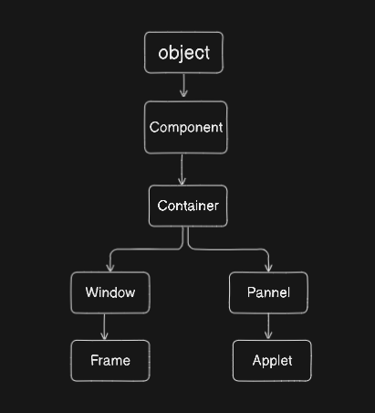

## JAVA AWT :
- AWT stands for Abstract Window Toolkit
- It is an API to develop GUI or window based application.
- AWT components are platform dependent (limitation)
- java awt package is used
- we use javaFX now a days
